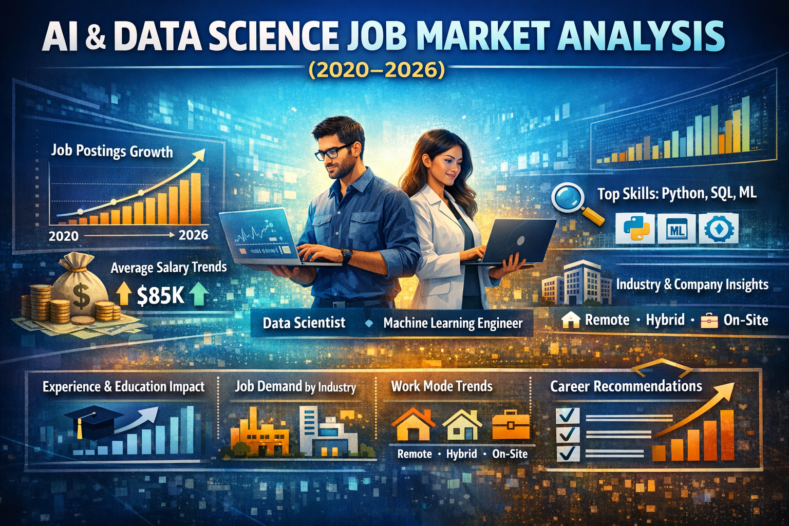
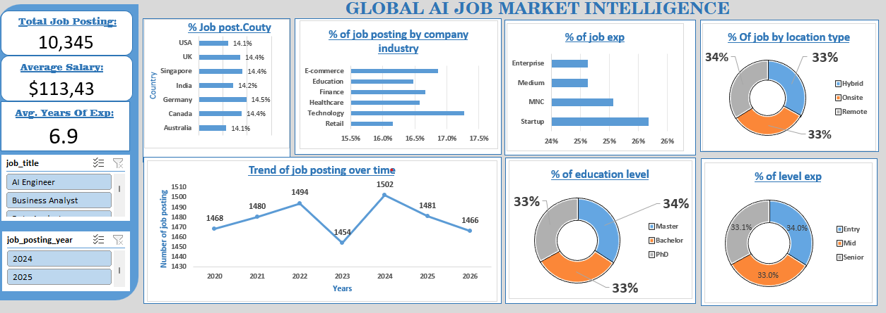

# AI-Data-Science-Job-Market-Analysis2020-2026

## Introduction

This project analyzes trends in the AI and Data Science job market between 2020 and 2026. With the rapid growth of technology and data-driven decision-making, there has been a significant increase in demand for professionals in this field.

The goal of this analysis is to explore key patterns in job postings, salary distributions, required skills, and hiring conditions. Using Excel for data cleaning, analysis, and visualization, this project aims to uncover meaningful insights that can guide job seekers, recruiters, and organizations in making informed decisions.

## About the Dataset

The dataset used in this project is the AI & Data Science Job Market Dataset (2020–2026). 

It contains structured information about job postings across different countries, industries, and company sizes. Each row represents a single job posting and includes details such as:

-Job title/role

-Company size and industry

-Required skills

-Education level

-Experience level
-Salary estimates
-Work mode (Remote, On-site, Hybrid)

-Hiring urgency

The dataset is synthetically generated but designed to reflect real-world hiring trends, making it suitable for analysis and portfolio projects.
 Problem Statement

Despite the growing demand for AI and data science professionals, many job seekers struggle to understand:

Which roles are most in demand?

The average salary across different job positions

The impact of experience and education on salary

The most required technical skills in the job market

How work mode (remote, hybrid, on-site) affects opportunities

## Visualization

Using Excel dashboards, the following visualizations were created:

Job postings trend over time (2020–2026)

Average salary by job role

Salary distribution by experience level

Job demand by company size and industry

Required skills frequency chart

Work mode distribution (Remote, Hybrid, On-site)

These visualizations help simplify complex data into understandable patterns for better decision-making.

## Insights

From the analysis, several key insights were discovered:

  1. Job demand has increased significantly over the years, showing strong growth in the AI and data science field.

  2. Data Scientist and Machine Learning Engineer roles are among the most in-demand positions.

  3. Higher experience levels lead to higher salaries, with senior roles earning significantly more than entry-level roles.

  4. Key technical skills such as Python, SQL, and Machine Learning are consistently in high demand.

  5. Remote and hybrid jobs are increasing, showing a shift toward flexible work environments.

  6. Larger companies tend to offer higher salaries, while smaller companies may offer more flexible roles.

This project aims to answer these questions by analyzing the dataset and presenting clear, visual insights.

## Recommendation

Based on the findings:

  -Job seekers should focus on learning high-demand skills such as Python, SQL, and Machine Learning.

  -Beginners should not be discouraged—entry-level roles are increasing, but continuous skill development is key.

  -Professionals should gain experience and certifications to increase their earning potential.

  -Companies should offer competitive salaries and flexible work options to attract top talent.

  -Educational institutions should align their curriculum with current industry skill demands.

### Conclusion

This project highlights the rapid growth and evolving nature of the AI and Data Science job market. The analysis shows clear trends in job demand, salary structures, and skill requirements.

By leveraging data analysis tools like Excel, meaningful insights can be extracted to guide career decisions and business strategies. As the industry continues to grow, staying updated with relevant skills and trends will remain essential for success.

